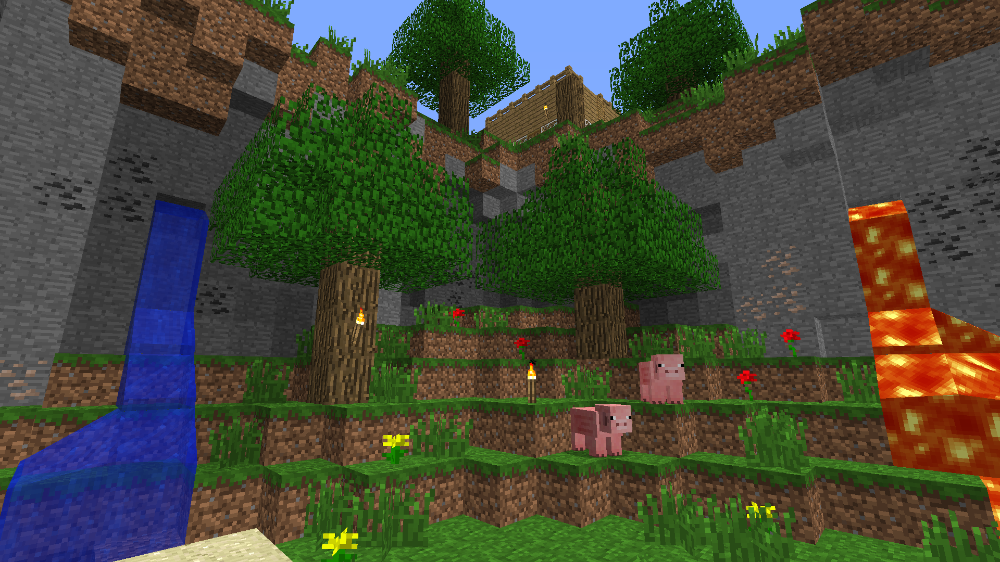

# Golden Days
Golden Days is a Minecraft resource pack meant to bring back old textures, lighting, names, and sounds from older versions of Minecraft.

Golden Days is split into 3 packs:
## Golden Days Base    
The main pack, meant to be usable in survival gameplay and does not remove any newer features in order to make it functional. Lighting, sounds, textures, and models! Everything you need for an authentic feeling experience. Use this pack on top of Programmer Art in order for it to work.
## Golden Days Alpha Addon
The Alpha Addon changes a few things, the main one being the iconic Alpha grass foliage color! Use this pack on top of the Base in order for an amazing Alpha-like experience in Modern Minecraft!
## Golden Days Picture Perfect
Picture Perfect is the most recent addon, made specifically for taking screenshots! This pack makes blocks such as Granite, Blue Orchids, or Tall Grass appear as blocks you could find in Beta and Alpha! Granite shows as stone, tall grass appears as normal grass, and more! This pack is not recommended for survival gameplay, as many blocks are not as they appear. Use this pack on top of the Base and/or Alpha Addon and take authentic screenshots!
    
## IMPORTANT (UPDATED): 
For 1.15 and below: This pack requires features provided in Optifine! 
In order to have the full experience, it is required. This pack uses the following features:
- Custom Colors
- Custom Entity Models

For 1.16 and above: As Optifine updates grow longer and longer, I am growing impatient. As a member of the Fabric modding community, Optifine is going farther out of the picture. OptiFabric, a mod made to implement Optifine support, is going under. This is because as Optifine implements more changes, we cannot keep up with the support. Optifine is closed source, so we cannot reference the code. Unless Optifine adds Fabric support, please try alternatives. Here is my list of alternative mods for Fabric:
- [Colormatic](https://www.curseforge.com/minecraft/mc-mods/colormatic) (Adds Custom Colors support): Required for water colors, grass colors, sky colors, and lightmap colors.
- [Lithium](https://www.curseforge.com/minecraft/mc-mods/lithium), and [Phosphor](https://www.curseforge.com/minecraft/mc-mods/phosphor): Performance mods to keep your game running smooth.
- [Sodium](https://www.curseforge.com/minecraft/mc-mods/sodium): A performance mod that increases performance dramatically. Not compatible with Fabric Renderer API as of 7/22/20. (Not compatible with Canvas).
- [Canvas](https://www.curseforge.com/minecraft/mc-mods/canvas-renderer): A performance mod that also aims to implement shader support. Compatible with Fabric Renderer API. (Not compatible with Sodium).
- [Soaring Clouds](https://www.curseforge.com/minecraft/mc-mods/soaring-clouds): Fabric mod that allows you to change the cloud height. Set to 108 for the Beta experience!
- Custom Entity Model Support: None available.

Please, please, please tell me when/if you use my resource pack in a video! Not because I'm a control freak, but instead because I would love to see you using it! <3

You are not allowed to redistribute my resource pack without official download links.You are not allowed to repackage my assets into your own resource pack without explicit permission.
