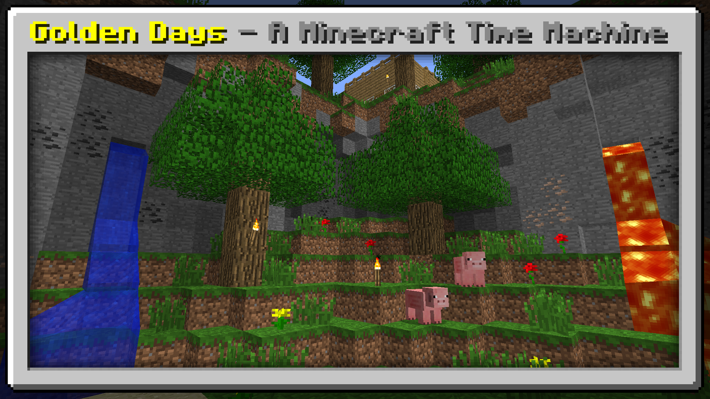

# Golden Days
Golden Days is a Minecraft resource pack meant to bring back old textures, lighting, names, and sounds from older versions of Minecraft.

Golden Days is split into 3 packs:
## Golden Days Base    
The main pack, meant to be usable in survival gameplay and does not remove any newer features in order to make it functional. Lighting, sounds, textures, and models! Everything you need for an authentic feeling experience. Use this pack on top of Programmer Art in order for it to work.
## Golden Days Alpha
The Alpha addon changes a few things, the main one being the iconic Alpha grass foliage color! Use this pack on top of Golden Days Base in order for an amazing Alpha-like experience in Modern Minecraft!
## Golden Days FastChest
FastChest is a mod created by fake_domi on CurseForge that allows Chests to be rendered using a block model. If you use this addon and that mod, your chests will look stunning.
## Golden Days Music
Golden Days Music is a new addon being created, inspired by SalC1's video on [The History of Minecraft's Music](https://www.youtube.com/watch?v=PX5LW6ICYY0). This pack removes all of the newer biome-specific music in the Overworld, and replaced it with good ol' music from C418.
## Golden Days Picture Perfect (Not currently being updated)
Picture Perfect is made specifically for taking screenshots! This pack makes blocks such as Granite, Blue Orchids, or Tall Grass appear as blocks you could find in Beta and Alpha! Granite shows as stone, tall grass appears as normal grass, and more! This pack is not recommended for survival gameplay, as many blocks are not as they appear. Use this pack on top of the Base and/or Alpha Addon and take authentic screenshots!
    
## IMPORTANT (UPDATED): 
This pack uses the following features:
- Custom Colors
- Custom Entity Models

If you use OptiFine, those will be included. However, if you use other mods; I have a list of mods that add those features AND more!

Performance:
- [Sodium](https://www.curseforge.com/minecraft/mc-mods/sodium): A performance mod that increases performance dramatically.
- [Indium](https://github.com/comp500/Indium): A mod that adds FRAPI support to Sodium.
- [Lithium](https://www.curseforge.com/minecraft/mc-mods/lithium), and [Phosphor](https://www.curseforge.com/minecraft/mc-mods/phosphor): Performance mods to keep your game running smooth.

Features:
- [Colormatic](https://www.curseforge.com/minecraft/mc-mods/colormatic) (Adds Custom Colors support): Required for water colors, grass colors, sky colors, and lightmap colors.
- [Soaring Clouds](https://www.curseforge.com/minecraft/mc-mods/soaring-clouds): Fabric mod that allows you to change the cloud height. Set to 108 for the Beta experience!
- [Modern Beta](https://www.curseforge.com/minecraft/mc-mods/modern-beta): Adds accurate beta and alpha generation back into Minecraft!
- [Custom Stars](https://www.curseforge.com/minecraft/mc-mods/custom-stars): Allows you to adjust the star size to make it look like Beta!
- [Custom Void](https://www.curseforge.com/minecraft/mc-mods/custom-void): Allows you to change the void color, allowing you to change it to the classic blue void!
- [Fabrication](https://www.curseforge.com/minecraft/mc-mods/fabrication): Allows you to have 2D dropped items, turn off Nether Fog (Beware as some servers might ban this), restore damage tilt, and have a true procedurally generated lava texture; among a multitude of other features.
- [Custom Entity Models (CEM)](https://www.curseforge.com/minecraft/mc-mods/custom-entity-models-cem): This mod implements OptiFine CEM! It is in Alpha right now and does NOT support chests, for that please refer to the next listing.
- [FastChest](https://www.curseforge.com/minecraft/mc-mods/fastchest): This mod adds true block models for chests and beds! This means they can have ambient occlusion and truly look amazing! Please use the Golden Days FastCraft compat addon if you use this mod.

Please, please, please tell me when/if you use my resource pack in a video! Not because I'm a control freak, but instead because I would love to see you using it! <3

You are not allowed to redistribute my resource pack without official download links. You are not allowed to repackage my assets into your own resource pack without explicit permission.
