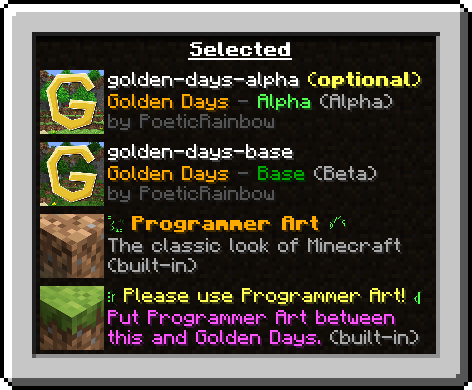

    <h1>
        Golden Days: A Minecraft Time Machine
    </h1>
    
    
    
    
    
    

        <b>Golden Days</b> is a texture pack for Minecraft that sends your game back in time. It changes blocks, items, mobs, and even GUI elements to be inspired by the past.
    

    

    <h2>:star: Golden Days Base</h2>
    The main pack, meant to be usable in survival gameplay and does not remove any newer features in order to make it functional. Lighting, sounds, textures, and models! Everything you need for an authentic feeling experience. Use this pack on top of Programmer Art in order for it to work.

    <h2>:star: Golden Days Alpha</h2>
    The Alpha addon changes a few things, the main one being the iconic Alpha grass foliage color! Use this pack on top of Golden Days Base in order for an amazing Alpha-like experience in Modern Minecraft!

    

---
#### Notice
>The following packs are experimental and may not always be updated.
### <ins>Golden Days Classic</ins>
This addon aims to transform your game into the free classic version of the game.

### <ins>Golden Days Music</ins>
Golden Days Music is a new addon being created, inspired by SalC1's video on [The History of Minecraft's Music](https://www.youtube.com/watch?v=PX5LW6ICYY0). This pack removes all of the newer biome-specific music in the Overworld, and replaced it with good ol' music from C418.

### <ins>Golden Days Picture Perfect</ins>
Picture Perfect is made specifically for taking screenshots! This pack makes blocks such as Granite, Blue Orchids, or Tall Grass appear as blocks you could find in Beta and Alpha! Granite shows as stone, tall grass appears as normal grass, and more! This pack is not recommended for survival gameplay, as many blocks are not as they appear. Use this pack on top of the Base and/or Alpha Addon and take authentic screenshots!

### <ins>Golden Days Tweaks</ins>
This is an overlay pack that is meant to go overtop of other resource packs in order to transform them into old Minecraft. This does not work with some packs.

---
## Mod Support
This pack has extended capabilities using some modded features:
- Custom Colors (dyed sheep, text colors, potion colors...)
- Custom Entity Models (boats, Zombie Pigmen, Allays, Bats...)

Features:
- [**Entity Model Features**](https://modrinth.com/mod/entity-model-features): Gives Golden Days the ability to modify entity models.
- [**PolyTone**](https://modrinth.com/mod/polytone): Adds many resource pack capabilities. Custom Colors, block properties, etc.
- [Enhanced Block Entities](https://modrinth.com/mod/ebe) (<1.21.4): Allows block entities to use JSON block models, gives full-block chest models with Golden Days.
- [Colormatic](https://modrinth.com/mod/colormatic) (outdated, replaced by PolyTone): Adds OptiFine Custom Colors support.

Pairs Well:
- [**Nostalgic Tweaks**](https://modrinth.com/mod/nostalgic-tweaks): A mod for Fabric/Forge that adds a whole ton of old Minecraft tweaks! It is really cool!
- [Modern Beta](https://modrinth.com/mod/moderner-beta): Adds accurate beta and alpha generation back into Minecraft!

Please, please, please tell me when/if you use my resource pack in a video! Not because I'm a control freak, but instead because I would love to see you using it! <3

You are not allowed to redistribute my resource pack without official download links. You are not allowed to repackage my assets into your own resource pack without explicit permission. Please contact me on Discord in order to work out permissions for your own projects.
